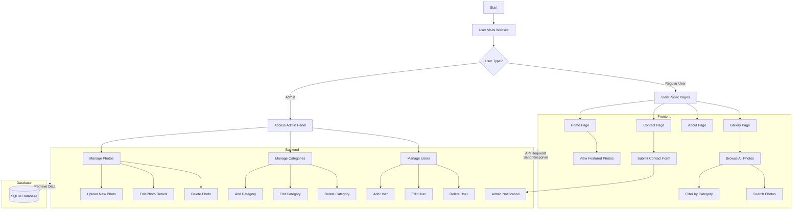

# Photography Portfolio Website Flowchart
# مخطط تدفق موقع محفظة التصوير الفوتوغرافي
# फोटोग्राफी पोर्टफोलियो वेबसाइट फ्लोचार्ट

## Components Description / وصف المكونات / घटकों का विवरण

### Frontend Components / مكونات الواجهة الأمامية / फ्रंटएंड घटक
1. **Home Page / الصفحة الرئيسية / होम पेज**
   - Featured photos display
   - Navigation menu
   - Welcome message

2. **Gallery Page / صفحة المعرض / गैलरी पेज**
   - Photo grid
   - Category filters
   - Search functionality

3. **About Page / صفحة حول / अबाउट पेज**
   - Company information
   - Team details
   - Mission statement

4. **Contact Page / صفحة الاتصال / कॉन्टैक्ट पेज**
   - Contact form
   - Location map
   - Contact information

### Backend Components / مكونات الخلفية / बैकएंड घटक
1. **Admin Panel / لوحة التحكم / एडमिन पैनल**
   - Photo management
   - Category management
   - User management

2. **API Endpoints / نقاط نهاية API / API एंडपॉइंट्स**
   - Photo CRUD operations
   - Category CRUD operations
   - User authentication

3. **Database / قاعدة البيانات / डेटाबेस**
   - Photo storage
   - Category data
   - User information
   - Contact form submissions

### Data Flow / تدفق البيانات / डेटा प्रवाह
1. **User Actions / إجراءات المستخدم / उपयोगकर्ता क्रियाएं**
   - View photos
   - Filter categories
   - Submit contact form
   - Admin operations

2. **System Processing / معالجة النظام / सिस्टम प्रोसेसिंग**
   - API requests
   - Database operations
   - File handling
   - Authentication

3. **Response Flow / تدفق الاستجابة / प्रतिक्रिया प्रवाह**
   - Data retrieval
   - Template rendering
   - User feedback 